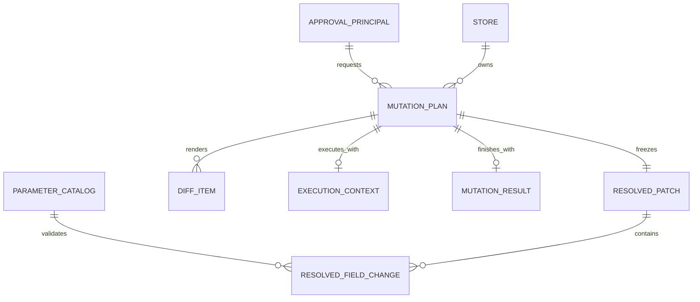
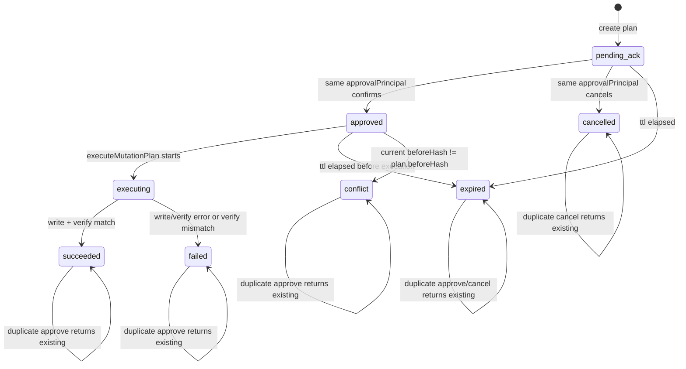

# OpenClaw Safe Mutation 关键技术要点

## 1. 代码重写时必须保留的核心不变量

如果用这份文档重新实现项目，优先保证以下不变量，不要先追求 UI 或业务字段完整度：

- `before_tool_call` 是最终写入口硬闸门，所有受保护写工具必须经过它。
- 每个受保护写路径必须有显式 `protectedMutations` binding，尤其是 `read` invocation；平台不能靠猜测完成读操作。
- 首次受保护写请求必须先阻断，并把这次真实请求中的最终 payload 冻结为 `MutationPlan`。
- 用户确认的是冻结 plan，不是让模型重新理解一遍自然语言。
- 当前文本 ACK 实现中，回复“确认”后由系统直接执行冻结 plan，不依赖模型重试原写工具。
- `reply_dispatch` 必须负责吞掉“已直接发送确认消息的 run”的普通 assistant 回复；不能放到 `before_agent_reply`。
- 执行器只接受 `planId`，从 store 读取冻结 plan，不能接收临时 payload。
- 写前必须比较当前快照 hash 和 plan.beforeHash；不一致进入 `conflict`，不写。
- 写后必须回读验证；不一致进入 `failed`。
- 审批身份以 `channel + senderId` 为主，`accountId` 可参与命名空间隔离；不要把 `sessionKey` 重新变成确认硬前提。
- plan 进入终态后不能回跳到活跃态。

## 2. 核心对象模型

### 2.1 `ParameterCatalog`

位置：`src/catalog.ts`

`ParameterCatalog` 是受保护字段白名单，也是 diff、payload 对比和 exec flag 解析的 source of truth。

关键字段：

```ts
interface ParameterCatalogItem {
  // 平台内部稳定字段 ID。所有 patch、diff、校验都引用它，不直接依赖中文名或 CLI flag。
  fieldId: string;

  // 给用户展示的字段名列表。通常 labels[0] 是中文业务名，后面可以放技术名。
  labels: string[];

  // 用户自然语言里可能出现的别名。用于意图归一化或规则匹配。
  aliases: string[];

  // 字段说明。可用于文档、提示词或调试，不应作为唯一执行依据。
  description: string;

  // 字段值类型。解析 CLI 参数、校验输入、格式化展示时使用。
  valueType: ParameterValueType;

  // 字段在完整 snapshot / writePayload 里的路径，支持点号路径。
  apiPath: string;

  // 最终写 payload 里是否要求包含该字段。全量写接口通常为 true。
  requiredInWritePayload: boolean;

  // 字段允许的变更操作。普通字段多为 set，列表字段可能是 replace_item。
  supportsOperations: MutationOperation[];
}
```

实现要求：

- 任何可写字段都必须在 catalog 中注册。
- 解析层不能接受未知 `fieldId` 或未知 CLI flag。
- diff 使用 `apiPath` 从 before/after snapshot 取值。
- `full_reduction_tiers` 与 `tier_1_threshold` 等标量字段是同一业务视图的两种表现，必须保持同步。

生命周期：

1. 生成阶段

   当前代码里 `ParameterCatalogItem` 不是每次请求动态生成的，而是在 `src/catalog.ts` 里以 `parameterCatalog` 常量静态定义。Node 加载这个模块时会创建数组和其中每个字段对象，之后由 ESM module cache 复用。

   如果真实系统以 CLI 为 source of truth，那么合理实现不是让每次写请求都解析 `--help`，而是在插件启动或构建阶段读取 CLI 的机器可读 schema / help 结果，把 CLI flag、类型、描述等信息编译成同样形态的 `ParameterCatalogItem[]`。运行时其他模块仍然只依赖 catalog，不直接散落解析 CLI 文案。

2. 注册 / 派生阶段

   `src/mutation-registry.ts` 会读取 `parameterCatalog` 派生默认 binding。例如当前默认 exec binding 用 `fieldId.replaceAll("_", "-")` 推导 CLI flag，把 `tier_1_threshold` 映射成 `--tier-1-threshold`。如果真实 CLI flag 不能这样推导，就必须在 binding 里显式配置 `mutableFlags` 到 `fieldId` 的映射。

3. 请求解析阶段

   当 `before_tool_call` 调用 `resolveProtectedWriteRequest` 时，catalog 会用于把 CLI 字符串参数解析成正确类型。例如 `valueType: "decimal"` 会让 `"14"` 变成数字 `14`。未知 `fieldId` 或未知 flag 必须 fail closed。

4. payload 构造阶段

   patch 型写入口会先读 beforeSnapshot，再调用 `buildWritePayload(beforeSnapshot, resolvedPatch, parameterCatalog)`。这里 catalog 负责把 `fieldId` 映射到 `apiPath`，把局部字段变更合并成完整 writePayload。

5. plan 冻结阶段

   `ensureProtectedWritePlan` 会遍历 catalog，从 `beforeSnapshot` 和 `writePayload` 中按 `apiPath` 比较每个字段，反推出本次真实变化的字段，生成 `resolvedPatch`、`mutationKind`、`interpretationText` 和 `diffItems`。

6. 展示阶段

   `buildDiffItems` 和 `renderMutationPlanForText` 会用 catalog 的 `labels` 生成用户可读的确认文案。

7. 执行阶段

   执行冻结 plan 时主要依赖 `plan.writePayload`、`plan.beforeHash` 和 `plan.executionContext`，不再重新依赖 catalog 生成写入内容。catalog 在执行阶段不是最终依据，避免确认后再次“解释字段”导致 payload 漂移。

8. 销毁阶段

   catalog 没有业务上的销毁动作。它是进程内元数据，通常随插件进程结束或模块卸载一起释放。单个 `MutationPlan` 不持有完整 catalog，只保存 `fieldId`、`diffItems` 和冻结 payload。

稳定性要求：

- 不要在还有 active plan 时随意改变 `fieldId` 或 `apiPath`，否则已冻结 plan 的展示、重试校验或后续审计可能对不上。
- `labels` 和 `description` 的变化主要影响新生成的确认文案；已生成 plan 的 `diffItems` 已经物化，不会自动刷新。
- 如果 CLI 是 source of truth，CLI schema 版本也应进入 binding 或 catalog 元数据，方便排查“plan 是基于哪一版 CLI 字段定义生成的”。

### 2.2 `ProtectedWriteRequest`

位置：`src/protected-write-request.ts`

`ProtectedWriteRequest` 是 hook 按 `src/mutation-registry.ts` 中的 binding 从真实工具调用中识别出来的规范化写请求。

逻辑结构：

```ts
interface ProtectedWriteRequest {
  // 规范化后的受保护工具名。exec 等价写命令也会归一到真实业务工具名。
  toolName: string;

  // 被修改的业务对象 ID。当前 demo 里是门店 ID / poiId。
  storeId: string;

  // 本次真实将要写入的完整 payload。创建 plan 后会被冻结。
  payload: Record<string, unknown>;

  // 写前快照。patch 型 binding 会先按 read invocation 读一次；full payload 型 binding 可留空后续再读。
  beforeSnapshot?: Record<string, unknown>;

  // 执行上下文。用于冻结如何重新读取、写入、验证这次变更。
  executionContext?: MutationExecutionContext;

  // 调用方携带的已批准 plan ID。首次裸写通常没有该字段，所以会被阻断。
  approvedPlanId?: string;

  // 请求来源。tool 表示直接业务工具调用，exec 表示从命令行写命令识别出来。
  source: "tool" | "exec";
}
```

实现要求：

- direct tool 调用必须匹配 `tool` binding；如果受保护工具没有匹配 binding，应 fail closed。
- `exec` 调用只识别 `exec` binding 明确声明的窄范围命令。
- 对 patch 型写命令，必须先按 binding.read 读取当前快照，再用确定性 `ResolvedPatch` 构造完整 `payload`。
- 对无法识别的普通 `exec` 命令要 allow，不要误杀 unrelated command。
- 对看起来是受保护写命令但含未知 flag、缺少值或缺少 `--poiid` 的请求要返回 error 并 fail closed。

### 2.3 `ProtectedMutationBinding`

位置：`src/mutation-registry.ts`

`ProtectedMutationBinding` 是批量接入写 skill 的核心配置对象。它把“写入口匹配规则”和“读当前状态的方法”绑定在一起。

关键字段：

```ts
interface ProtectedMutationBinding {
  id: string;
  protectedToolName: string;
  match: ExecCommandMutationMatch | ToolPayloadMutationMatch;
  read: MutationInvocationTemplate;
  write?: MutationInvocationTemplate;
  verify?: MutationInvocationTemplate;
  compareNormalizer?: SnapshotNormalizerId;
}
```

实现要求：

- `read` 必填，读返回必须是 JSON object，或通过 `resultPath` 选中 JSON object。
- `exec` binding 只拦截匹配 `scriptBasename`、`writeSubcommand`、`resourceFlag` 和 `mutableFlags` 的命令。
- `mutableFlags` 必须显式映射到 `ParameterCatalog.fieldId`；未知 flag 必须 fail closed。
- `shell` invocation 使用 `commandTokens` 模板并逐 token quote，不能拼接不可信 shell 字符串。
- `verify` 省略时复用 `read`。
- `compareNormalizer` 只用于写后验证比较，例如剥离 `version`、`updated_at`。

### 2.4 `ResolvedPatch`、`DiffItem`、`MutationResult`

位置：`src/intent-types.ts`

这几个对象是 `MutationPlan` 的组成部分。`ResolvedPatch` 描述“哪些字段要变”，`DiffItem` 描述“给用户看什么 before/after”，`MutationResult` 描述“最后执行结果如何”。

```ts
interface ResolvedPatchFieldChange {
  // 被修改的字段 ID，必须来自 ParameterCatalog.fieldId。
  fieldId: string;

  // 本字段的变更操作，例如 set 或 replace_item。
  operation: MutationOperation;

  // 已归一化后的字段新值。不能直接保存未经解析的自然语言。
  normalizedInput: unknown;
}

interface ResolvedPatch {
  // 固定类型标识，方便后续扩展其他 patch 类型。
  kind: "mutation.resolved.patch";

  // 被修改的业务对象 ID。必须和 MutationPlan.storeId 一致。
  storeId: string;

  // 本次变更涉及的字段列表。
  fieldChanges: ResolvedPatchFieldChange[];
}

interface DiffItem {
  // 被展示的字段 ID，必须对应本次 resolvedPatch 里的字段。
  fieldId: string;

  // 展示名。通常取 ParameterCatalog.labels[0]。
  label: string;

  // 写前值，从 beforeSnapshot 按 apiPath 取出。
  before: unknown;

  // 写后值，从 writePayload 按 apiPath 取出。
  after: unknown;
}

interface MutationResult {
  // 底层写调用是否返回成功。当前 CLI adapter 用 exitCode === 0 判断。
  writeSucceeded?: boolean;

  // 写后回读结果是否和冻结 writePayload 匹配。
  verifySucceeded?: boolean;

  // 写命令 stdout，主要用于审计和排障。
  writeStdout?: string;

  // 写命令 stderr，主要用于审计和排障。
  writeStderr?: string;

  // 写后实际回读到的快照。
  verifySnapshot?: Record<string, unknown>;

  // 失败、冲突、取消等场景的错误说明。
  error?: string;
}
```

### 2.5 `MutationPlan`

位置：`src/intent-types.ts`

`MutationPlan` 是系统唯一可信的冻结记录。

关键字段：

```ts
interface MutationPlan {
  // 高熵、不可枚举的计划 ID。文本 demo 会展示，结构化 UI 可隐藏在 callback payload。
  planId: string;

  // 变更类型描述，例如 protected_write.activity_name，用于审计和观测。
  mutationKind: string;

  // 计划状态。状态机见后文。
  status: MutationPlanStatus;

  // 被修改的业务对象 ID。当前 demo 里是门店 ID / poiId。
  storeId: string;

  // 用户原始请求或系统生成的请求说明，用于展示和审计。
  userText: string;

  // 系统对本次变更的解释，例如“修改字段「活动名称」”。
  interpretationText: string;

  // 创建 plan 时的写前完整快照。
  beforeSnapshot: Record<string, unknown>;

  // beforeSnapshot 规范化后的 hash，用于执行前检测状态漂移。
  beforeHash: string;

  // 纯代码解析后的确定性字段变更列表。
  resolvedPatch: ResolvedPatch;

  // 冻结的最终写入 payload。执行时只能使用它，不能重新生成。
  writePayload: Record<string, unknown>;

  // 给用户展示的 before/after diff，不作为执行依据。
  diffItems: DiffItem[];

  // 发起变更的人。当前通常来自 senderId 或 agentId 兜底。
  requestedBy: string;

  // 审批所在渠道，例如 feishu、wechat。
  approvalChannel?: string;

  // 审批人稳定 ID。会和 channel 组合成 approvalPrincipal。
  approvalSenderId?: string;

  // 可选账号/租户命名空间，用于多账号隔离。
  approvalAccountId?: string;

  // 稳定审批身份，格式是 channel:senderId 或 channel:accountId:senderId。
  approvalPrincipal?: string;

  // 实际批准人展示名或 ID。
  approvedBy?: string;

  // 实际批准人的规范化审批身份。
  approvedPrincipal?: string;

  // 读、写、验证所需的执行上下文。保存 bindingId 和冻结的 read/write/verify invocation。
  executionContext?: MutationExecutionContext;

  // 发起 plan 时的会话 key。用于追踪，不作为 ACK 硬校验条件。
  sessionKey?: string;

  // 发起 plan 时的渠道，主要用于展示和审计。
  channel?: string;

  // 创建时间，Unix epoch milliseconds。
  createdAtMs: number;

  // 过期时间，超过后不能批准或执行。
  expiresAtMs: number;

  // 批准时间。
  approvedAtMs?: number;

  // 开始执行时间。
  executedAtMs?: number;

  // 进入终态的时间。
  finishedAtMs?: number;

  // 幂等键。当前主要是预留审计字段，重写时不要拿它替代 plan 状态机。
  idempotencyKey: string;

  // 执行、验证、取消或失败的结果详情。
  result?: MutationResult;
}
```

实现要求：

- `writePayload` 必须 `structuredClone` 后存储，后续不能被外部引用修改。
- `beforeHash` 使用规范化 snapshot 计算，字段顺序不能影响 hash。
- `diffItems` 是展示用，不是执行依据；执行依据是 `writePayload`。
- `executionContext` 用于把 plan 绑定到真实读写路径，当前保存 `configured_mutation` 的 `bindingId`、`readInvocation`、`writeInvocation`、`verifyInvocation`。
- `planId` 应是高熵不可枚举 ID。文本 demo 会展示它；结构化 UI 中建议隐藏在 callback payload。

### 2.6 `MutationPlanStore`

位置：`src/plan-store.ts`、`src/file-plan-store.ts`

接口：

```ts
interface MutationPlanStore {
  // 新建 plan。planId 已存在时必须报错，不能覆盖。
  create(plan: MutationPlan): Promise<void>;

  // 按 planId 读取 plan。返回值应 clone，避免调用方直接改内部状态。
  get(planId: string): Promise<MutationPlan | undefined>;

  // 查询某个业务对象下仍处于活跃态的 plan。
  listActiveByStore(storeId: string): Promise<MutationPlan[]>;

  // 查询某个审批身份下待确认的 plan，用于用户只回复“确认”时自动定位。
  listPendingByApprovalPrincipal(approvalPrincipal: string): Promise<MutationPlan[]>;

  // 更新完整 plan。必须校验终态不可回跳。
  update(plan: MutationPlan): Promise<void>;

  // 只更新状态的便捷方法。仍必须遵守状态机约束。
  updateStatus(planId: string, status: MutationPlanStatus): Promise<void>;

  // 保存执行结果的便捷方法。
  saveResult(planId: string, result: MutationPlan["result"]): Promise<void>;
}
```

实现要求：

- 对外读写都 clone，避免调用方修改 store 内部状态。
- `listActiveByStore` 只返回 `pending_ack`、`approved`、`executing`。
- `listPendingByApprovalPrincipal` 使用 `sameApprovalPrincipal`，兼容历史上 channel-prefixed senderId 的持久化数据。
- 从终态到任何非同状态更新都必须拒绝。
- 文件版 store 当前按 `rootDir/plans/<planId>.json` 存储；生产版替换数据库时仍要保留同样状态迁移约束。

## 3. ER / 关系模型



关系约束：

- 一个 `approvalPrincipal` 可以有多个历史 plan，但文本无 planId 确认时只能在“唯一 pending plan”场景下自动选择。
- 一个 `storeId` 可以有多个历史 plan，但同一时刻只允许一个不同 payload 的 active plan。
- 相同 `storeId + writePayload` 的活跃 plan 应复用，避免重复发送多个等价确认。
- `ResolvedPatch` 描述哪些 catalog 字段发生变化，`writePayload` 描述最终完整写入对象，两者都属于同一个 plan。
- `MutationResult` 只在执行或取消后出现，用于记录 write/verify/error 信息。

## 4. 状态机



状态规则：

- 活跃态：`pending_ack`、`approved`、`executing`。
- 终态：`succeeded`、`failed`、`conflict`、`cancelled`、`expired`。
- `executing` 不能取消。
- 终态 plan 幂等返回，不再触发写入。
- `approved` 状态下重复确认只允许同一审批人或同一 `approvedPrincipal`。

## 5. Hook 与事件职责

### 5.1 `before_tool_call`

位置：`src/hooks/before-tool-call.ts`，注册点在 `openclaw.entry.ts`

职责：

- 调用 `resolveProtectedWriteRequest`，按 `ProtectedMutationRegistry` 识别 direct tool 或 equivalent `exec` 写请求。
- unrelated `exec` 直接 allow。
- 受保护直接写工具如果没有匹配 binding，直接 block，原因是缺少读配置。
- 没有 `approvedPlanId` 的受保护写请求 block，并把 `protectedWriteRequest` 返回给入口层生成 plan。
- 带 `approvedPlanId` 时校验 plan 存在、状态 `approved`、未过期、`storeId` 一致、payload 完全一致。

payload 一致性校验：

- direct tool：比较 `{ storeId, payload }` 与 `{ storeId: plan.storeId, payload: plan.writePayload }`。
- exec source：先规范化成同样结构再比较。
- 比较前使用 `normalizeSnapshot` + SHA-256 hash，保证对象 key 顺序不影响结果。

注意：

- 当前 guard 接收 `actor` 但不使用，因为审批身份校验在 ACK 命令层完成。
- 不要把 `sessionKey` 放回 guard 的放行条件。session 是对话上下文，不是稳定审批身份。

### 5.2 `before_dispatch`

注册点：`openclaw.entry.ts`

职责：

- 用 `parseTextPlanAction` 识别“确认/确认执行/批准/同意/取消/取消变更/放弃”。
- 如果用户没有带 `planId`，按当前 `approvalPrincipal` 查询 pending plan。
- 0 个 pending：不处理，让消息继续走普通流程。
- 1 个 pending：自动确认或取消。
- 多个 pending：返回提示，要求用户指定 `planId`。
- 确认时调用 `runMutateApproveCommand`，当前实现会立即执行冻结 plan。
- 取消时调用 `runMutateCancelCommand`。

文本 ACK 不是 slash command。`/mutate-approve` 和 `/mutate-cancel` 是历史形态，不应作为当前主链路前提。

### 5.3 `reply_dispatch`

注册点：`openclaw.entry.ts`

这是防止误导回复的关键 seam。

必须放在 `reply_dispatch` 的原因：

- 工具调用是在 LLM turn 中途发生的。
- `before_tool_call` block 后，模型可能继续生成一条普通最终回复。
- `before_agent_reply` 发生在 LLM turn 开始前，无法拦住这个“工具中途被 block 后的补充回复”。
- `reply_dispatch` 才能在最终回复分发阶段按 `runId` 把它吞掉。

实现要点：

- 在直接发送确认消息成功后，把 `runId` 放入 `directConfirmationRunIds`。
- `reply_dispatch` 命中该 `runId` 后删除集合项，调用 `recordProcessed` 和 `markIdle`，返回 `{ handled: true, queuedFinal: true, counts }`。
- `agent_end` 再兜底删除 `runId`。
- blockReason 只能提示模型，不是可靠 suppression；真正可靠的 suppression 是事件分发层吞掉回复。

## 6. 写请求解析细节

### 6.1 registry 与 binding

当前默认内置一条 binding：

- `id`: `mock-full-reduction.exec`
- `protectedToolName`: `mock-full-reduction-config`
- `match.kind`: `exec`
- `read.kind`: `shell`

插件配置可通过 `protectedMutations` 覆盖内置 binding。每条 binding 都必须显式声明 `read`，这是批量接入几百个写 skill 的前提。

要求：

- `protectedToolName` 是规范化后的业务写工具名。
- `match` 定义如何识别真实写入口。
- `read` 定义如何读取当前状态。
- `write` 对 direct tool binding 必填；exec binding 默认冻结原始 shell 写命令。
- `verify` 可选，省略时复用 `read`。

没有 matching binding 的受保护直接工具调用不会继续创建 plan，而是 fail closed。

### 6.2 direct tool

direct tool binding 使用：

- `match.kind = "tool"`
- `match.toolName`
- `match.resourceParamPath`
- `match.payloadParamPath`

如果 direct tool 要走当前“回复确认后系统直接执行”的文本 ACK 路径，binding 必须提供 `write` invocation。否则系统不知道如何在 ACK 后重放写入，应 fail closed。

### 6.3 equivalent `exec`

默认 mock binding 的识别范围：

- hook toolName 必须是 `exec`。
- command 必须能被窄 shell tokenizer 切成 token。
- 可选前缀：环境变量赋值。
- 执行器必须长得像 `python`、`python3` 或带版本号的 python。
- script basename 来自 binding，默认是 `mock_full_reduction_cli.py`。
- 子命令必须是 binding 声明的 `writeSubcommand`，默认是 `write`；`readSubcommand` 不拦截。
- 支持 binding 声明的 `preSubcommandFlags`、`resourceFlag`、`ignoredWriteFlags` 和 `mutableFlags`。

实现要点：

- `--state-file value` 和 `--state-file=value` 都要支持。
- 相对 script path 要结合 `workdir` 解析。
- 生成 shell read invocation 时要逐 token quote。
- 写前通过 `readSnapshotFromExecutionContext` 读取 beforeSnapshot。
- `ResolvedPatch` 由 CLI flag 转成 fieldChanges。
- `payload` 由 `buildWritePayload(beforeSnapshot, resolvedPatch, parameterCatalog)` 构造。

安全边界：

- 这个 tokenizer 不是通用 shell parser，必须保持窄范围识别。
- 未知 pre-write token、未知 flag、缺少 flag value 都必须 fail closed。
- unrelated exec 不能 block，否则会破坏普通工具使用。

## 7. Payload 冻结、diff 与 hash

### 7.1 从 writePayload 反推 patch

位置：`src/protected-write-plan.ts`

`ensureProtectedWritePlan` 用 catalog 遍历所有字段：

1. 从 `beforeSnapshot` 和 `writePayload` 的 `apiPath` 取值。
2. 用规范化 JSON 比较判断字段是否变化。
3. after 值为 `undefined` 时抛错，因为受保护 payload 缺必要字段。
4. 没有任何 catalog 字段变化时抛错。
5. `full_reduction_tiers` 变化时删除 tier scalar field 的重复变化，避免一个业务变更展示成多个内部字段。

### 7.2 tier 双视图同步

位置：`src/payload-builder.ts`

当前样例同时存在：

- 业务 list 视图：`promotion.full_reduction_tiers`
- CLI scalar 视图：`tier_1_threshold`、`tier_1_discount` 等

同步规则：

- 如果修改 `full_reduction_tiers`，且 snapshot 里有 scalar 字段，则把 list 同步回 scalar 字段。
- 如果修改 scalar 字段，则用 scalar 字段重建 `promotion.full_reduction_tiers`。
- 这样 direct payload、exec payload、read/verify snapshot 才能稳定比较。

### 7.3 Hash 规范化

位置：`src/snapshot-normalizer.ts`

规则：

- object key 排序。
- `undefined` 字段丢弃。
- array 顺序保留。
- SHA-256 作用于规范化 JSON。

注意：

- mock CLI 的 `version`、`updated_at` 通过 `compareNormalizer = "stripVolatileFields"` 在写后验证比较时被剥离。
- 它们不会在 `beforeHash` 阶段剥离，因此确认后如果外部写入改变了这些字段，会触发 `conflict`。这是有意设计。

## 8. 审批身份

位置：`src/approval-principal.ts`

身份结构：

```text
channel:senderId
channel:accountId:senderId
```

实现要求：

- `senderId` 如果已经带 `channel:` 前缀，要规范化去掉前缀。
- 历史持久化值如 `feishu:default:feishu:ou_alice` 要能规范化成 `feishu:default:ou_alice`。
- `sameApprovalPrincipal` 是唯一比较入口，不要直接字符串比较。
- ACK 可以来自不同 session，只要 approval principal 一致即可。
- `accountId` 可选；有多账号/多租户风险时应带上。

来源解析：

- 首次 plan 创建从 session entry 的 `deliveryContext`、`lastChannel`、`origin` 中解析。
- ACK 从 dispatch event 和 hook context 中解析。
- 发送确认消息需要 `channel + to`，这来自 session delivery context 或 last fields。

## 9. 执行链路

### 9.1 `runMutateApproveCommand`

位置：`src/commands/mutate-approve.ts`

流程：

1. 读取 plan。
2. terminal 或 `executing` 直接返回，保证重复确认幂等。
3. 校验 `approvalPrincipal` 必须匹配原请求人。
4. 过期则标记 `expired`。
5. `pending_ack` 改为 `approved`，写入 `approvedBy`、`approvedPrincipal`、`approvedAtMs`。
6. 调用 `executeMutationPlan`。

注意：

- 当前文本确认路径中 approve 与 execute 是连续的。
- 如果未来改成按钮只标记 approved，再由调用方携带 `approvedPlanId` 重试，也必须保留 guard 的 payload 精确匹配。

### 9.2 `runMutateCancelCommand`

位置：`src/commands/mutate-cancel.ts`

流程：

1. terminal 直接返回。
2. `executing` 不允许取消。
3. 校验 approval principal。
4. 过期则标记 `expired`。
5. 标记 `cancelled` 并写入 result error。

### 9.3 `executeMutationPlan`

位置：`src/executor.ts`

流程：

1. 只接受 `approved` plan。
2. 过期则标记 `expired`。
3. 使用冻结的 `readInvocation` 读取当前配置，计算 hash。
4. `currentHash !== beforeHash` 时标记 `conflict`，不调用 write adapter。
5. 标记 `executing`。
6. 调用 `writeAdapter.writeConfig`，按冻结的 `writeInvocation` 写入。
7. 调用 `verifyAdapter.verifyCurrentConfig`，按冻结的 `verifyInvocation` 或 `readInvocation` 回读。
8. 对 verify snapshot 和 writePayload 做必要规范化后 hash 比较。
9. 匹配则 `succeeded`，否则 `failed`。

生产化注意：

- 当前 demo 记录 `writeSucceeded = exitCode === 0`，最终状态主要由 verify 是否匹配决定。
- 接真实工具时，建议让 adapter 对明确写失败抛错或让执行器把 non-zero exit 直接视为 failed，避免“写失败但回读偶然匹配”造成误判。

## 10. 测试覆盖地图

现有测试按层验证以下能力：

- `test/unit/core-invariants.test.ts`：状态集合、catalog、hash、终态不可回跳、按 principal 查 pending。
- `test/unit/protected-write-request.test.ts`：exec 写命令规范化、相对路径和 workdir、payload 构造。
- `src/mutation-registry.ts` 当前通过 protected-write-request 和 tool-backed integration 间接覆盖；后续增加多 binding 时应补独立单元测试。
- `test/unit/protected-write-plan.test.ts`：从真实 payload 创建 plan、相同 payload 复用、同店不同 active plan 阻断。
- `test/unit/approval-principal.test.ts`：senderId 和 principal 规范化。
- `test/unit/text-plan-actions.test.ts`：文本确认/取消解析，不接受旧 slash command。
- `test/seams/before-tool-call.test.ts`：unrelated exec 放行、裸写阻断、缺 binding 阻断、payload 不一致阻断、完全一致放行。
- `test/integration/workflow.test.ts`：成功、冲突、回读失败、幂等、字段目录、tier 同步、跨 session approve/cancel、不同 principal 拒绝。
- `test/integration/tool-backed-workflow.test.ts`：真实 mock CLI read/write/verify 闭环。

重写时至少要保留这些测试语义。尤其是 `reply_dispatch` suppression 当前缺少专门测试，如果继续演进，应该补 seam test 覆盖“确认消息已直接发送后，普通 assistant final 被吞掉”的场景。

## 11. 常见坑位清单

- 不要让模型在用户确认后再生成一次 payload；确认后只能执行 `plan.writePayload`。
- 不要把 `before_tool_call` 只当提醒 hook；它必须 fail closed。
- 不要把 suppression 放进 `before_agent_reply`；它挡不住工具中途被 block 后模型补一句的场景。
- 不要只靠 blockReason 约束模型回复；必须在 `reply_dispatch` 事件层处理。
- 不要用 `sessionKey` 校验 ACK；session 变化不应让同一个人无法确认。
- 不要直接字符串比较 approval principal；必须规范化。
- 不要允许同店多个不同 active plan 并存，除非实现了明确的合并和冲突策略。
- 不要把 diff 当执行依据；diff 只用于展示。
- 不要忽略 `beforeHash`；确认后状态漂移必须 conflict。
- 不要只相信写接口返回；必须 verify。
- 不要把 unrelated `exec` 全拦掉；只拦截可确定的受保护写命令。
- 不要接受未知 CLI flag；这类请求应 fail closed。
- 不要只登记写工具名；缺少 `protectedMutations` read binding 的写路径必须 fail closed。
- 不要在 hook 里根据脚本名、参数名猜读命令；读操作必须来自 binding。
- 不要忘记清理 `directConfirmationRunIds`；`reply_dispatch` 和 `agent_end` 都要清。
- 不要新增受保护 direct tool 后忘记实现执行 adapter；否则文本确认会创建无法执行的 plan。
- 不要把终态 plan 更新回活跃态；重复操作应幂等返回。

## 12. 新增一个受保护写工具的最低步骤

1. 增加一条 `protectedMutations` binding，声明 `id`、`protectedToolName`、`match`、`read`。
2. 对 patch 型写入口，配置 `mutableFlags` 到 `ParameterCatalog.fieldId` 的映射。
3. 对 direct tool 且需要文本 ACK 直接执行的场景，显式配置 `write` invocation。
4. 为该工具补充 catalog 字段或独立 catalog，确保所有可写字段有稳定 `fieldId` 和 `apiPath`。
5. 必要时配置 `resultPath`、`normalizer`、`compareNormalizer`。
6. 保证 `ensureProtectedWritePlan` 能从 before/after 推导出至少一个字段变化。
7. 补齐 guard seam tests：裸写阻断、缺 binding 阻断、错误 plan 阻断、payload drift 阻断、完全一致放行。
8. 补齐 integration tests：成功、冲突、verify failed、重复确认幂等、跨 session 同 principal 确认。

只要这些步骤完成，skill 作者不需要自己实现审批流程，平台侧 hook 就能提供统一兜底。
