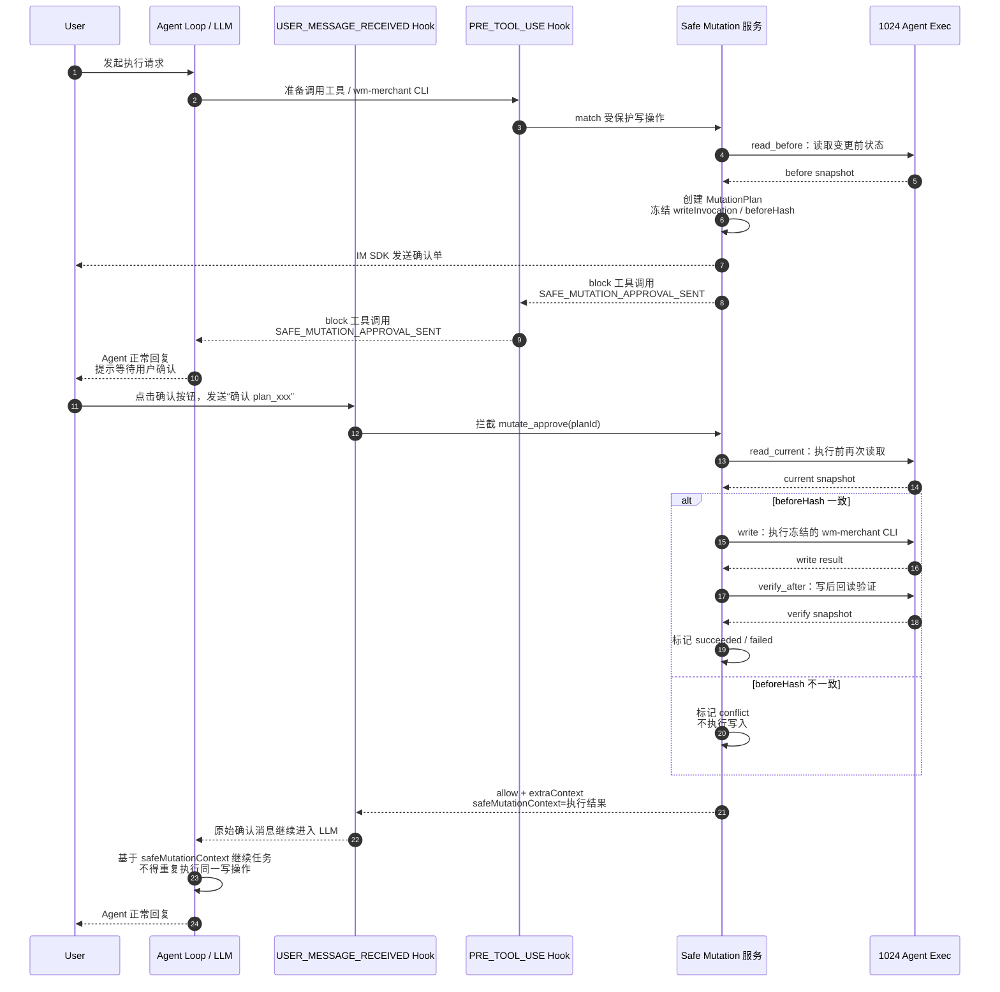

# Safe Mutation 1024Agent 适配方案

## 1. 目标

`openclaw-safe-mutation` 已经验证了一套面向 Agent/Skill 写操作的安全拦截机制：写请求第一次出现时不直接执行，而是冻结成 `MutationPlan`，发给用户确认；用户确认后，由系统执行被冻结的写入，并在执行前后做状态校验。

本方案的目标是把这套能力从 OpenClaw 扩展到 1024Agent，同时避免把安全语义复制成两套实现。最终形态应是：

- OpenClaw 和 1024Agent 共享同一套 Safe Mutation core。
- 框架差异收敛在 adapter 层。
- 1024Agent 的业务写 CLI 可以被统一拦截、确认、执行和验证。
- 后续新增受保护写操作时，只需要新增 binding 和测试，不需要改 Skill 主流程。

当前保护对象不是本地文件写入，而是 Skill 或模型通过 CLI、shell、HTTP 工具触发的业务写操作，例如：

```text
wm-merchant product set-status 23202203439 23200980370 --status 0
```

期望闭环：

1. 受保护写路径在 registry 中显式登记。
2. 模型或 Skill 首次调用写路径时，1024Agent 在工具执行前阻断真实写入。
3. Safe Mutation 读取写前状态，冻结真实 CLI/payload，创建 `MutationPlan`。
4. 系统向原会话发送确认单。
5. 用户回复确认或取消。
6. 确认后由系统执行冻结 plan，不让模型重新生成命令。
7. 执行前再次读取业务对象，比较 `beforeHash`。
8. 执行后回读验证最终状态。

## 2. 基本判断

复核本仓库当前实现后，结论需要从“准备抽 core”调整为“基于已拆出的 TypeScript core 继续做 1024 adapter”。

当前已经完成的可复用能力包括：

- `src/core/mutation-registry.ts`
  - 支持 `tool`、`exec`、`cli` 三类 binding。
  - `cli` matcher 已支持三态：`matched`、`not_matched`、`suspicious`。
  - 已支持 inline/shell/http field schema。
- `src/core/protected-write-request.ts`
  - 已能把受保护写请求解析成 `ProtectedWriteRequest`。
  - 对 `exec`/`cli` 写命令，会先用冻结的 read invocation 读取 before snapshot，再构造完整 write payload。
- `src/core/protected-write-plan.ts`
  - 已实现 plan 创建、同 storeId 活跃计划检查、相同 payload 复用、不同 payload 阻断。
- `src/core/executor.ts`
  - 已实现确认后 CAS 抢占 `approved -> executing`、读取当前状态、`beforeHash` conflict 检查、执行冻结 write invocation、verify 回读。
- `src/core/commands/mutate-approve.ts` / `mutate-cancel.ts`
  - 已实现文本 ACK 的批准/取消入口，批准时通过 CAS 推进 `pending_ack -> approved`，然后直接执行冻结 plan。
- `src/core/plan-store.ts`
  - 已包含 `tryTransition()` CAS 语义，供文件、内存、SQLite/MySQL store 统一实现。
- `src/core/tool-backed-adapters.ts`
  - 已提供 shell/http read/write/verify adapter。
- `src/core/text-plan-actions.ts` 和 `src/core/channels/text-render.ts`
  - 已提供中文文本 ACK 解析和确认单渲染。
- `src/openclaw/*`
  - OpenClaw adapter 已迁移到 `src/openclaw`。
  - `openclaw.entry.ts` 负责把 `before_tool_call` 和 `before_dispatch` 接到 core。

因此 1024Agent MVP 不应再包含“Core 抽取”和“CLI matcher 从零实现”。正确方向是：

- 直接复用 `src/core` 的 registry、resolver、plan builder、executor、renderer、ACK parser。
- 继续完善 1024 adapter 层：payload 转换、webhook handler、notifier、本地 SQLite plan store、后续生产 MySQL store、部署入口。
- 只在 core 补生产必需的缺口；CAS/事务状态迁移和基础投递状态字段已经进入 core，后续重点是并发覆盖、真实执行接口和生产配置加载。
- 保持 OpenClaw 现有行为和测试不变。

## 3. 总体架构

逻辑上仍按四层理解，但当前代码不必强行拆成独立 npm package。推荐先在现有 TypeScript 仓库内增量扩展：

```text
src/core/
  registry / request resolver / plan builder
  plan store interface
  approval parser / approve-cancel command
  executor / renderer / hash / diff / schema
  cli matcher / shell tokenizer / suspicious classifier
  tool-backed shell/http read-write-verify adapter

src/openclaw/
  before_tool_call adapter
  FileMutationPlanStore

src/agent1024/
  PRE_TOOL_USE webhook endpoint
  USER_MESSAGE_RECEIVED webhook endpoint
  SQLiteMutationPlanStore
  MySQLMutationPlanStore
  IM SDK notifier
  1024 runtime execution client
  mock 1024 runtime execution server/client
  1024 payload/response mapper
  1024 shell/http invocation adapter backed by runtime execution API
```

核心原则：

- Safe Mutation 的安全语义只实现一次。
- OpenClaw 和 1024Agent 共享 `MutationPlan`、状态机、diff、hash、审批校验和执行器。
- adapter 只负责把框架 payload 转成 core 输入，把 core 输出转成框架响应。
- `cli` matcher 当前已在 `src/core/mutation-registry.ts` 内实现，短期不用拆 `safe-mutation-cli-binding` 包；只有当独立发布或复用边界变复杂时再拆包。
- 1024Agent 平台需要提供 Webhook 链式执行、fail-close 策略、同环境工具执行接口和必要的身份字段。
- Safe Mutation 给真实用户发送确认单和执行结果时，只使用外部 IM SDK，不使用 1024Agent 会话接口。
- `POST /openapi-v3/react/chat` 只用于测试阶段模拟用户发消息；真实线上生产环境中，用户消息入口不经过 Safe Mutation 主动调用该接口。

## 4. 关键状态机

`MutationPlan` 建议保持以下状态：

```text
pending_ack
approved
executing
succeeded
cancelled
expired
conflict
failed
```

状态推进规则：

```text
pending_ack -> approved -> executing -> succeeded
pending_ack -> cancelled
pending_ack -> expired
approved -> expired
approved -> executing -> conflict
approved -> executing -> failed
executing -> succeeded
executing -> conflict
executing -> failed
```

要求：

- 终态包括 `succeeded`、`cancelled`、`expired`、`conflict`、`failed`。
- 终态不允许回跳到活跃态。
- `approved -> executing` 必须通过 CAS 或事务抢占。
- 重复确认同一 plan 不能重复执行。
- 执行器只能执行 plan 中冻结的 write invocation，不能使用 ACK 文本里的任何新参数。

## 5. 1024Agent 平台能力要求

### 5.1 多 Webhook 链式执行

1024Agent 需要支持同一事件配置多个 Webhook，并按顺序执行。

建议链式规则：

```text
按 paas + eventType 查询 enabled hooks
按 hook_order asc, id asc 排序

逐个执行 hook:
  matcher 不命中则跳过
  hook 调用失败:
    fail_policy = FAIL_CLOSED 时直接阻断
    fail_policy = FAIL_OPEN 时继续执行后续 hook
  response.block 为 true 时短路阻断
  response.direct_reply 存在时短路回复
  PRE_TOOL_USE 且 response.updatedArguments 存在时，向后传递更新后的 toolArguments

全部执行完后放行最终 toolArguments
```

关键约束：

- `block` 和 `direct_reply` 必须短路后续 hook。
- `PRE_TOOL_USE` 的 `updatedArguments` 必须向后传递。
- Safe Mutation 的 `PRE_TOOL_USE` hook 应检查链式改写后的最终参数。
- 每个 hook 独立配置 `fail_policy`。
- Safe Mutation 命中的受保护写路径必须 fail-closed。

### 5.2 Hook 配置字段

建议 1024Agent Webhook 配置补齐以下字段：

```text
id
paas
event_type
hook_url
hook_order
enabled
fail_policy: FAIL_OPEN / FAIL_CLOSED
matcher_type: TOOL_NAME / TOOL_PREFIX / MESSAGE_REGEX / NONE
matcher
timeout_ms
description
```

Safe Mutation 推荐配置：

```text
event_type = PRE_TOOL_USE
hook_order = 900
fail_policy = FAIL_CLOSED
matcher_type = TOOL_NAME
matcher = bash
timeout_ms = 3000
```

```text
event_type = USER_MESSAGE_RECEIVED
hook_order = 10
fail_policy = FAIL_CLOSED
matcher_type = MESSAGE_REGEX
matcher = ^(确认执行|确认|批准|同意|取消变更|取消|放弃)(\s+plan_[A-Za-z0-9_-]+)?$
timeout_ms = 5000
```

ACK hook 的 matcher 必须窄。只有明显是确认或取消的消息才进入 Safe Mutation ACK hook，避免 Safe Mutation 服务故障时阻断普通聊天。

### 5.3 fail-close 配置要求

1024 Webhook 新版本支持把拦截类 hook 配置为 fail-close。Safe Mutation 生产接入必须使用 fail-close 配置，不能依赖默认 fail-open 行为。

要求：

- Safe Mutation 的 `PRE_TOOL_USE` webhook 必须配置 fail-close。
- Safe Mutation 的 `USER_MESSAGE_RECEIVED` ACK webhook 必须配置 fail-close，但 matcher 必须足够窄，只匹配明确的确认/取消文本。
- 如果使用 1024 Webhook SDK，必须确认 SDK 不会把 handler 异常吞掉并返回 `allow`；否则 Safe Mutation adapter 应独立实现 HTTP handler，或使用支持 handler 级 fail-close 的 SDK 版本。
- 超时、非 2xx、响应解析失败、handler 未捕获异常，都必须能被平台识别为 hook failure。
- Safe Mutation `PRE_TOOL_USE` 对受保护写路径的 hook failure 必须 fail-closed。

### 5.4 用户消息、通知与上下文边界

生产环境中，Safe Mutation 不通过 1024 会话接口给用户发消息。确认单由 IM SDK 发送；确认后的执行结果不直接通过 IM SDK 发给用户，而是通过 `USER_MESSAGE_RECEIVED` webhook 的 `extraContext` 注入给 LLM，让 Agent 在原任务链路中继续推理并正常回复用户。

边界如下：

```text
用户普通消息 -> 1024Agent 原有入口
用户确认/取消消息 -> 1024 USER_MESSAGE_RECEIVED webhook -> Safe Mutation 执行/取消
确认单 -> Safe Mutation -> IM SDK -> 用户
执行结果 -> Safe Mutation -> USER_MESSAGE_RECEIVED extraContext -> LLM -> 用户
测试阶段模拟用户消息 -> POST /openapi-v3/react/chat
```

因此 `USER_MESSAGE_RECEIVED` ACK hook 命中后不应 `direct_reply` 或静默消费，而应在执行完 Safe Mutation 后返回 `allow + extraContext`。用户原始确认消息继续进入 LLM，但 LLM 必须通过 `safeMutationContext` 获知刚刚发生的安全变更结果。

推荐 1024 Agent 系统提示词预留变量：

```text
${safeMutationContext}
```

推荐系统提示词约束：

```text
如果 safeMutationContext 不为空，说明用户刚刚确认或取消了一个受保护写操作。
你必须基于该上下文继续当前任务。
如果上下文显示写操作已执行成功，不要重复调用同一个写工具或重新生成同一命令。
如果上下文显示 conflict、failed、cancelled 或 expired，向用户解释当前状态，并不要继续执行该写操作。
```

ACK 执行成功时，hook 推荐返回：

```json
{
  "decision": "allow",
  "extraContext": {
    "safeMutationContext": "用户确认了受保护变更 plan_xxx。Safe Mutation 已执行冻结写操作。状态：succeeded。冻结命令：wm-merchant product set-status 23202203439 23200980370 --status 0。验证结果：商品状态已更新为下架。请基于该结果继续完成原任务，不要重复调用同一写工具。"
  }
}
```

ACK conflict / failed 时，hook 仍返回 `allow + extraContext`，但上下文必须说明写操作未完成或验证失败：

```json
{
  "decision": "allow",
  "extraContext": {
    "safeMutationContext": "用户确认了受保护变更 plan_xxx，但 Safe Mutation 未执行写操作。状态：conflict。原因：执行前状态与确认单生成时不一致。请向用户说明变更未执行，并建议重新发起。"
  }
}
```

ACK 取消时：

```json
{
  "decision": "allow",
  "extraContext": {
    "safeMutationContext": "用户取消了受保护变更 plan_xxx。Safe Mutation 未执行写操作。请停止该变更相关后续步骤，并向用户确认已取消。"
  }
}
```

## 6. Hook 顺序

### 6.1 PRE_TOOL_USE

推荐顺序：

```text
普通业务 PRE_TOOL_USE hooks
  -> 参数注入、鉴权补充、业务改写
Safe Mutation PRE_TOOL_USE hook
  -> 检查最终 toolArguments
  -> 命中保护写路径则冻结 plan 并 block
```

原因：

- 普通业务 hook 可能改写 CLI 参数。
- Safe Mutation 要保护的是最终将被执行的命令，而不是模型最初生成的命令。
- 因此 Safe Mutation 应尽量放在链尾。

### 6.2 USER_MESSAGE_RECEIVED

推荐顺序：

```text
Safe Mutation ACK hook
  -> 消费 确认/取消 <planId>
  -> 命中后执行/取消 plan，并返回 allow + extraContext
普通业务 USER_MESSAGE_RECEIVED hooks
  -> 权限、上下文注入、模型切换等
LLM
```

原因：

- 用户回复 `确认 plan_xxx` 是系统控制指令，必须先由 Safe Mutation ACK hook 消费并执行安全状态机。
- ACK hook 必须在普通业务 hook 和 LLM 之前执行。
- ACK hook 不改写 `messageContent`，而是通过 `extraContext.safeMutationContext` 把执行结果告诉 LLM。
- LLM 继续处理当前任务时，必须基于 `safeMutationContext`，不能重复调用同一写操作。
- 非 ACK 普通消息不应被 Safe Mutation 影响。

## 7. 1024 PRE_TOOL_USE 流程

输入：

```text
PreToolUsePayload
- paas
- conversationId
- source
- userMis
- accountId?
- toolName
- toolArguments
- requestId / traceId
```

处理流程：

```text
1. 从 payload 中提取 toolName 和 toolArguments。
2. 将 1024 的工具参数规范化成 core 输入：
   2.1 shell/bash 类工具：{ toolName, params: { command, workdir?, approvedPlanId? } }。
   2.2 HTTP/结构化工具：{ toolName, params: 原始结构化参数 }。
3. 调用 `guardBeforeToolCall()`。
4. guard 返回 allow：直接放行最终 toolArguments。
5. guard 返回 block 且 reason 是 `This write path requires an approved mutation plan.` 且带 `protectedWriteRequest`：
   5.1 调用 `ensureProtectedWritePlan()` 创建或复用 pending_ack plan。
   5.2 使用 `renderMutationPlanForText()` 生成确认单。
   5.3 通过 IM SDK notifier 按 `userMis` 和会话路由发送确认单。
   5.4 记录投递状态。
   5.5 block 当前工具调用，并返回 `SAFE_MUTATION_APPROVAL_SENT`。
6. guard 返回 block 且没有可创建确认单的 request：fail-closed block，返回具体原因。
7. 可疑 CLI 命中会在 registry/resolver 阶段转成 error，必须 fail-closed block。
8. 若请求携带 approvedPlanId：
   8.1 `guardBeforeToolCall()` 校验 plan 存在、已批准、未过期。
   8.2 校验当前 target 和 payload 与 plan 冻结内容一致。
   8.3 校验通过才 allow。
```

首版建议采用“ACK 后系统直接执行冻结 plan”，不依赖 `approvedPlanId` 重试原工具调用。但 core 仍应保留该校验能力，给未来结构化审批或框架原生重试留出口。

1024 MVP 默认走当前 OpenClaw 已验证的“ACK 后系统直接执行冻结 plan”链路。`approvedPlanId` 路径只作为兼容入口保留，不作为第一版主流程。

1024 adapter 的 PRE_TOOL_USE handler 伪代码：

```ts
const decision = await guardBeforeToolCall(
  { planStore, protectedMutationRegistry },
  {
    toolName: payload.toolName,
    params: normalize1024ToolArguments(payload.toolName, payload.toolArguments),
    approvedPlanId: getApprovedPlanId(payload.toolArguments),
    actor: payload.userMis,
    storeId: getStoreIdIfStructured(payload.toolArguments)
  }
);

if (decision.action === "allow") {
  return { decision: "allow" };
}

if (
  decision.reason === "This write path requires an approved mutation plan." &&
  decision.protectedWriteRequest
) {
  const result = await ensureProtectedWritePlan(...);
  const delivery = await notifier.sendApproval(...);
  return delivery.ok
    ? { decision: "block", reason: approvalSentReason(result.plan.planId) }
    : { decision: "block", reason: approvalDeliveryFailedReason(result.plan.planId) };
}

return { decision: "block", reason: decision.reason };
```

工具被 block 后，返回给模型的 reason 必须约束行为：

```text
SAFE_MUTATION_APPROVAL_SENT.
The protected write tool call was blocked; the write has not been executed yet.
A frozen approval request has already been sent to the user via IM.
Do not retry the tool.
Do not regenerate the command or payload.
Reply briefly in the user's language: 已生成变更确认单，确认后系统会自动执行。
```

如果确认消息投递失败，必须返回不同 reason：

```text
SAFE_MUTATION_APPROVAL_DELIVERY_FAILED planId=...
The write was blocked and has not been executed.
The approval request could not be delivered through IM SDK.
Do not ask the user to confirm this plan because they may not have seen the diff.
```

## 8. 1024 USER_MESSAGE_RECEIVED 流程

输入：

```text
UserMessageReceivedPayload
- paas
- conversationId
- source
- userMis
- accountId?
- messageContent
- requestId / traceId
```

审批身份：

```text
approvalPrincipal = paas + ":" + conversationId + ":" + userMis
```

如果 1024 存在多租户、多账号或同一 MIS 多身份问题，升级为：

```text
approvalPrincipal = paas + ":" + conversationId + ":" + accountId + ":" + userMis
```

处理流程：

```text
1. parseTextPlanAction(messageContent)。
2. 非 ACK 文本：allow。
3. ACK 无 planId：
   3.1 按 approvalPrincipal 查询 pending plan。
   3.2 0 个：返回 allow + extraContext，提示 LLM 告知用户没有待确认变更。
   3.3 1 个：使用该 plan。
   3.4 多个：返回 allow + extraContext，提示 LLM 要求用户指定 planId。
4. 确认：
   4.1 校验审批身份、plan 状态、TTL、投递状态。
   4.2 pending_ack -> approved。
   4.3 调用 1024 同环境执行接口执行冻结 plan。
   4.4 返回 allow + extraContext，把执行状态和结果摘要注入 LLM。
5. 取消：
   5.1 校验审批身份、plan 状态。
   5.2 pending_ack -> cancelled。
   5.3 返回 allow + extraContext，把取消状态注入 LLM。
```

ACK hook 执行后继续进入 LLM。生产推荐返回 `decision=allow + extraContext.safeMutationContext`；用户原始确认消息不改写，LLM 通过 `safeMutationContext` 获取 Safe Mutation 执行结果。

1024 adapter 可以直接复用当前 core 命令：

- 确认：`runMutateApproveCommand({ planStore, readAdapter, writeAdapter, verifyAdapter }, input)`。
- 取消：`runMutateCancelCommand({ planStore }, input)`。
- 回复文本：`renderMutationPlanStatusForText(plan)`。

注意当前 `runMutateApproveCommand()` 的语义是“把 `pending_ack` 推进到 `approved` 后立刻执行冻结 plan”。因此 1024 的 ACK webhook 不需要、也不应该让 LLM 再生成一次写命令。

无 planId 的 ACK 推荐沿用现有策略：

- 按 `approvalPrincipal` 查 `pending_ack`。
- 0 个待确认：返回 allow + extraContext，提示 LLM 告知用户没有待确认变更。
- 1 个待确认：直接使用该 plan。
- 多个待确认：返回 allow + extraContext，提示 LLM 要求用户指定 planId。

`extraContext.safeMutationContext` 至少应包含：

- `planId`。
- 用户动作：确认或取消。
- plan 最终状态：`succeeded`、`conflict`、`failed`、`cancelled`、`expired`。
- 是否已执行真实写入。
- 冻结命令或业务摘要。
- verify 结果摘要。
- 对 LLM 的约束：已成功执行时不得重复调用同一写工具；失败或冲突时不得继续执行该写操作。

首版推荐把不同终态的 `safeMutationContext` 固定为以下口径，避免 LLM 误判是否可以继续执行写操作。

成功 `succeeded`：

```text
用户确认了受保护变更 {planId}。Safe Mutation 已执行冻结写操作。状态：succeeded。{frozenWriteSummary}。验证结果：{verifySummary}。请基于该结果继续完成原任务，不要重复调用同一写工具。
```

冲突 `conflict`：

```text
用户确认了受保护变更 {planId}，但 Safe Mutation 未执行写操作。状态：conflict。原因：执行前状态与确认单生成时不一致，可能已有其他人或系统修改了同一业务对象。{frozenWriteSummary}。请向用户说明本次变更未执行，并建议重新发起变更确认；不要继续执行该写操作。
```

执行或校验失败 `failed`：

```text
用户确认了受保护变更 {planId}，但 Safe Mutation 未能确认最终写入成功。状态：failed。原因：{errorSummary}。{frozenWriteSummary}。写入接口返回：{writeSummary}。回读验证：{verifySummary}。请向用户说明变更结果未确认成功，不要重复调用同一写工具；如需继续，应重新发起新的受保护变更流程或转人工排查。
```

过期 `expired`：

```text
用户确认了受保护变更 {planId}，但该确认单已过期，Safe Mutation 未执行写操作。状态：expired。{frozenWriteSummary}。请向用户说明原确认单已失效，如仍需变更，需要重新发起操作并生成新的确认单；不要继续执行该写操作。
```

取消 `cancelled`：

```text
用户取消了受保护变更 {planId}。Safe Mutation 未执行写操作。状态：cancelled。{frozenWriteSummary}。请停止该变更相关后续步骤，并向用户确认已取消。
```

### 8.1 端到端时序

确认后继续交给 LLM 的完整链路如下：



## 9. CLI Binding 设计

OpenClaw 当前 `exec` matcher 更偏 Python 脚本子命令，例如：

```text
python script.py write --resource ... --field ...
```

1024Agent 更可能出现普通业务 CLI：

```text
wm-merchant product set-status 23202203439 23200980370 --status 0
```

当前实现已经在 `src/core/mutation-registry.ts` 中提供通用 `cli` matcher，1024 adapter 应复用这套 matcher，而不是在 adapter 里硬编码命令解析。

建议 binding 结构：

```yaml
id: wm-product-set-status
protectedToolName: wm-product-set-status
match:
  kind: cli
  toolName: bash
  commandPrefix:
    - wm-merchant
    - product
    - set-status
  positionals:
    - variableName: merchantId
    - variableName: productId
  mutableFlags:
    "--status":
      fieldId: status
  resourceIdTemplate: "wm-product-status:{{merchantId}}:{{productId}}"
fieldSchema:
  kind: inline
  fields:
    - fieldId: status
      label: 商品状态
      readPath: status
      valueType: enum
      enumValues:
        - "0"
        - "1"
      flag: "--status"
      requiredInPayload: true
read:
  kind: shell
  commandTokens:
    - wm-merchant
    - product
    - get-status
    - "{{merchantId}}"
    - "{{productId}}"
verify:
  kind: shell
  commandTokens:
    - wm-merchant
    - product
    - get-status
    - "{{merchantId}}"
    - "{{productId}}"
compareNormalizer:
  kind: pickPath
  path: status
```

### 9.1 CLI 解析 MVP 规则

首版只支持：

- 单条 CLI 命令。
- 普通空格分隔。
- 单引号、双引号。
- 反斜杠转义。
- `--flag value`。
- `--flag=value`。
- 固定 command prefix。
- 固定位置参数。
- 当前实现允许命令开头出现 `A=B` 形式的 env assignment，并把它作为 `envAssignmentTokens` 模板变量；1024 若认为这会扩大风险，可在 adapter 配置中关闭或禁止。

首版明确不支持：

- `cmd1 && cmd2`
- `cmd1 ; cmd2`
- 管道。
- 反引号命令替换。
- `$()` 命令替换。
- heredoc。
- `timeout 10 ...`
- `bash -lc "..."`
- alias 展开。

后续可以按白名单扩展 wrapper，但不能默认放行。

当前 core 已实现上述大部分规则：

- `tokenizeShellCommand()` 处理单双引号和反斜杠。
- `scanShellCommand()` 识别 `;`、`|`、`&`、反引号、`$()`、heredoc。
- `matchCliCommand()` 要求 prefix 出现在开头；如果 prefix 出现在 wrapper 或复合命令内部，返回 `suspicious`。
- `parseFieldValue()` 按 schema 将 string、boolean、integer、decimal、enum、json 转成规范值。
- read/write/verify invocation 使用 `commandTokens` 模板并逐 token shell quote，避免直接拼接模板字符串。

### 9.2 三态匹配

CLI matcher 不应只返回 boolean，必须返回三态：

```text
matched
not_matched
suspicious
```

语义：

- `not_matched`：完全未命中受保护前缀，放行。
- `matched`：命中且解析完整，进入 plan 流程。
- `suspicious`：出现受保护命令片段，但有 shell operator、wrapper、命令替换、参数缺失或字段非法，fail-closed。

这样可以同时避免两个问题：

- 未保护命令被误拦，影响可用性。
- 复合 shell 包含受保护写命令却绕过拦截，影响安全性。

## 10. Binding 上线契约

每个受保护 CLI binding 必须提供：

- `id`：稳定且全局唯一。
- `protectedToolName`：规范化后的业务写入口名，例如 `wm-product-set-status`；真实 1024 工具名放在 `match.toolName`，例如 `bash`。
- `match`：命令匹配规则。
- `resourceIdTemplate`：生成业务对象唯一键。
- `fieldSchema`：可变字段目录。
- `read`：写前读取 invocation。
- `verify`：写后验证 invocation，未配置时可复用 read。
- `compareNormalizer`：只允许显式归一化已知易变字段。
- read/verify 输出样例。
- read/verify JSON schema。
- binding 级测试用例。

对 `match.kind = tool` 的结构化工具 binding，还必须显式配置 `write` invocation；当前 core 会在 direct tool binding 缺少 `write` 时 fail-closed。

字段约束：

- `fieldSchema.readPath` 必须覆盖所有可能被 write payload 改变的字段。
- `requiredInPayload = true` 的字段在写 payload 中缺失时 fail-closed。
- normalizer 不能默认忽略未知字段。
- read/verify 解析失败、字段缺失、类型不匹配时 fail-closed。

## 11. Plan Store

OpenClaw 可以继续使用文件 store。1024Agent 生产环境最终应使用 MySQL store，但当前 MVP 先使用本地 SQLite store 完成状态机、CAS、webhook 重试和测试闭环。SQLite store 和 MySQL store 必须实现同一个 core `MutationPlanStore` 接口，保证后续替换存储时不改 adapter 和 executor 语义。

建议接口语义：

```text
create(plan)
get(planId)
listActiveByStore(storeId)
listPendingByApprovalPrincipal(approvalPrincipal)
update(plan)
updateStatus(planId, status)
saveResult(planId, result)
tryTransition(planId, fromStatus, toStatus, patch)
```

当前 `src/core/plan-store.ts` 的 `MutationPlanStore` 已包含 `tryTransition()` CAS 接口：

```ts
interface MutationPlanStore {
  tryTransition(
    planId: string,
    fromStatus: MutationPlanStatus,
    toStatus: MutationPlanStatus,
    patch?: Partial<Omit<MutationPlan, "planId" | "status">>
  ): Promise<MutationPlan | undefined>;
}
```

当前 core 已同步完成：

- `runMutateApproveCommand()`：`pending_ack -> approved` 使用 CAS。
- `executeMutationPlan()`：`approved -> executing` 使用 CAS 抢占。
- 抢占失败时重新 `get(planId)`，若已终态则幂等返回，若仍活跃则返回当前状态。
- `FileMutationPlanStore` 和测试内存 store 保持 OpenClaw 行为兼容。
- `Agent1024SqliteMutationPlanStore` 已在 `src/agent1024/sqlite-plan-store.ts` 中实现本地可运行版本，并使用 `where plan_id=? and status=? and version=?` 语义验证 CAS。
- `MySQLMutationPlanStore` 后续生产化时复用 SQLite 已验证的 SQL 语义，改成 MySQL driver 和字段类型。

SQLite MVP 表结构建议：

```text
safe_mutation_plan
- id INTEGER PRIMARY KEY AUTOINCREMENT
- plan_id TEXT UNIQUE NOT NULL
- paas TEXT
- conversation_id TEXT
- store_id TEXT NOT NULL
- binding_id TEXT
- status TEXT NOT NULL
- approval_principal TEXT
- requested_by TEXT
- approved_by TEXT
- before_hash TEXT
- payload_hash TEXT
- field_schema_hash TEXT
- approval_delivery_status TEXT
- approval_message_id TEXT
- plan_json TEXT NOT NULL
- result_json TEXT
- created_at_ms INTEGER NOT NULL
- expires_at_ms INTEGER NOT NULL
- approved_at_ms INTEGER
- executed_at_ms INTEGER
- finished_at_ms INTEGER
- version INTEGER NOT NULL DEFAULT 1
```

SQLite MVP 索引：

```text
idx_store_status(store_id, status)
idx_principal_status(approval_principal, status)
idx_conversation_status(conversation_id, status)
idx_expires_at(expires_at_ms)
idx_binding_status(binding_id, status)
```

当前 `Agent1024SqliteMutationPlanStore` 的表结构比上面的生产建议更精简，只保存 MVP 已使用的检索字段和完整 `plan_json`；生产 MySQL 表可以按上述字段补齐 `paas`、`conversation_id`、`binding_id`、`payload_hash` 等审计维度。

生产 MySQL 表结构可以沿用同名字段，把 `TEXT` 调整为 `VARCHAR`/`MEDIUMTEXT`，把毫秒时间戳按平台规范保留为 `BIGINT` 或转换为 `DATETIME`。关键不是字段类型，而是 `tryTransition()` 必须具备：

```sql
update safe_mutation_plan
set status = ?, plan_json = ?, version = version + 1
where plan_id = ? and status = ? and version = ?
```

关键要求：

- 同一 `storeId` 默认只能存在一个活跃 plan。
- 相同 payload 可以复用已有 `pending_ack` plan。
- 不同 payload 命中同一 `storeId` 时，提示先处理已有计划。
- `pending_ack -> approved` 必须带状态条件。
- `approved -> executing` 必须带状态条件和 version。
- 终态更新必须校验当前状态不是终态。
- Webhook 重试、用户多端回复、重复点击不能造成重复写入。

## 12. 确认单投递

确认单投递不能只看发送 API 是否返回成功。需要记录投递状态：

```text
approval_delivery_status:
  pending
  sent
  delivered
  read
  failed
  unknown
```

首版如果 1024 通道没有 delivered/read 回执，至少记录：

- `sent`：发送 API 成功并返回 messageId。
- `failed`：发送 API 失败。
- `unknown`：发送 API 成功但没有 messageId 或通道语义不可靠。

当前 core 的 `MutationPlan` 已补入基础投递字段，1024 适配应继续把投递状态写回 plan，而不是只放在 MySQL 表外字段中：

```ts
approvalDeliveryStatus?: "pending" | "sent" | "delivered" | "read" | "failed" | "unknown";
approvalMessageId?: string;
approvalDeliveredAtMs?: number;
approvalReadAtMs?: number;
```

当前实现已使用 `approvalDeliveryStatus` 和 `approvalMessageId`；`approvalDeliveredAtMs`、`approvalReadAtMs` 可在接入真实回执后补齐。

这样 ACK 执行前可以在 `runMutateApproveCommand()` 或 1024 ACK handler 中统一校验投递状态，避免不同 adapter 各自解释“用户是否看过确认单”。

ACK 执行前建议校验：

- `failed`：不允许确认，提示重新生成确认单。
- `unknown`：首版可允许，但结果文案中提示确认的是最近一次待确认变更；高风险写操作建议不允许。
- `sent/delivered/read`：允许继续审批。

未来优先接入结构化卡片按钮，callback payload 中携带 `planId`，减少用户手写 planId 和误确认概率。

## 13. 执行器要求

确认后执行流程：

```text
1. get(planId)。
2. plan 不存在：返回错误。
3. plan 是终态：直接返回当前结果，不重复执行。
4. plan 非 approved：返回错误。
5. plan 过期：标记 expired。
6. 抢占 approved -> executing。
7. 读取 currentSnapshot。
8. hash(currentSnapshot) != beforeHash：标记 conflict，不写入。
9. 执行冻结 writeInvocation。
10. verify/read 回读。
11. 回读结果与冻结 writePayload 比较。
12. 标记 succeeded 或 failed。
```

重要约束：

- ACK 不能携带新的写入参数。
- 执行器只能执行 plan 中冻结的 CLI / write payload。
- 不自动重试写命令。
- 写接口返回成功不等于最终成功，必须以后置 verify 为准。
- `conflict` 表示写前状态漂移，不能继续写。
- 真实 write 已发出但 verify 失败时，状态应为 `failed`，结果中保留 write response 和 verify snapshot，方便人工处理。
- 1024 adapter 不在 Safe Mutation 服务本机执行 `wm-merchant`；read/write/verify 都调用 1024 提供的同环境工具执行接口完成。

1024 同环境执行接口首版先 mock，后续替换为平台真实接口。建议契约：

```http
POST /mock-1024/runtime/tool-executions
Content-Type: application/json
```

```json
{
  "paas": "your-paas-name",
  "conversationId": "conv_abc123",
  "userMis": "zhangsan",
  "toolName": "bash_execute",
  "toolArguments": {
    "command": "wm-merchant product set-status 23202203439 23200980370 --status 0"
  },
  "safeMutation": {
    "planId": "plan_xxx",
    "phase": "write",
    "idempotencyKey": "plan_xxx:write",
    "payloadHash": "sha256..."
  },
  "traceId": "trace_xxx"
}
```

```json
{
  "executionId": "exec_xxx",
  "status": "succeeded",
  "exitCode": 0,
  "stdout": "{\"status\":0}",
  "stderr": "",
  "startedAt": 1710000000000,
  "finishedAt": 1710000001200
}
```

`safeMutation.phase` 至少支持：

```text
read_before
write
verify_after
```

1024 runtime execution client 需要提供幂等能力：同一个 `idempotencyKey` 重复请求不能重复执行真实 write。若 1024 平台执行接口会再次触发 `PRE_TOOL_USE`，请求必须携带 `approvedPlanId` 或等价字段，Safe Mutation 校验冻结 payload 后放行，避免确认后执行被再次拦截成新 plan。

当前 core 已完成关键 CAS 改造：

- `executeMutationPlan()` 先通过 CAS 抢占 `approved -> executing`，抢占成功的实例才允许继续 read/write/verify。
- `runMutateApproveCommand()` 中 `pending_ack -> approved` 使用 CAS，避免两个 ACK 同时把同一 plan 推进到执行链路。
- 重复 ACK 或 webhook 重试会重新读取当前 plan 并按终态幂等返回。

进入真实 webhook 多实例部署前，仍需补足 runtime executor 幂等测试和平台侧同环境执行接口契约验证。

## 14. 1024 与 OpenClaw 的边界

| 能力 | OpenClaw | 1024Agent |
| --- | --- | --- |
| 工具前拦截 | `before_tool_call` | `PRE_TOOL_USE` webhook |
| 文本 ACK | `before_dispatch` / dispatch adapter | `USER_MESSAGE_RECEIVED` webhook |
| 存储 | 文件 store | SQLite store（MVP）/ MySQL store（生产） |
| 发消息 | OpenClaw outbound adapter | IM SDK notifier |
| 审批身份 | channel/senderId/accountId | paas/conversationId/userMis/accountId |
| 配置来源 | pluginConfig / repo config | DB/Lion/配置文件，最终加载成同一 binding |
| CLI 执行 | ToolBackedAdapters | 1024 同环境 runtime execution API |
| fail 策略 | OpenClaw hook 策略 | 1024 Webhook fail-close 配置 |
| 用户消息入口 | OpenClaw dispatch | 生产由 1024 原入口承接；chat OpenAPI 仅测试模拟 |

除上述差异外，以下能力必须共用 core：

- binding registry
- request resolver
- plan builder
- diff
- hash
- field schema
- text ACK parser
- approve/cancel command
- executor
- renderer

### 14.1 1024 adapter 到现有 core 的复用清单

1024 adapter 应直接调用以下现有模块：

```text
PRE_TOOL_USE:
  src/openclaw/hooks/before-tool-call.ts::guardBeforeToolCall
  src/core/protected-write-plan.ts::ensureProtectedWritePlan
  src/core/channels/text-render.ts::renderMutationPlanForText

USER_MESSAGE_RECEIVED:
  src/core/text-plan-actions.ts::parseTextPlanAction
  src/core/commands/mutate-approve.ts::runMutateApproveCommand
  src/core/commands/mutate-cancel.ts::runMutateCancelCommand
  src/core/channels/text-render.ts::renderMutationPlanStatusForText

执行适配:
  src/core/tool-backed-adapters.ts::ToolReadAdapter
  src/core/tool-backed-adapters.ts::ToolWriteAdapter
  src/core/tool-backed-adapters.ts::ToolVerifyAdapter
  src/agent1024/runtime-executor.ts::Agent1024RuntimeExecutionClient

配置加载:
  src/core/mutation-registry.ts::loadProtectedMutationRegistry
```

`guardBeforeToolCall` 当前放在 `src/openclaw/hooks`，但它本身只依赖 core 类型和 registry，不包含 OpenClaw SDK 依赖。为了让 1024 复用更自然，建议后续移动或重导出为：

```text
src/core/hooks/before-tool-call.ts
```

迁移时保持 `src/openclaw/hooks/before-tool-call.ts` 兼容导出，避免破坏 OpenClaw 现有引用。

## 15. 配置加载

建议将受保护写配置分成两类：

```text
static bindings
  随代码发布，适合高风险基础命令

dynamic bindings
  从 DB/Lion/配置中心加载，适合业务快速扩展
```

加载要求：

- 启动时校验所有 binding schema。
- 每条 binding 生成 `bindingSnapshot` 和 `fieldSchemaHash`。
- plan 中冻结 binding 关键内容，避免配置变更影响已生成 plan。
- 动态配置更新后只影响新 plan，不影响已 pending/approved 的 plan。
- binding 删除后，历史 plan 仍能取消；确认执行应按冻结内容执行或按安全策略拒绝，不能静默使用新配置。

## 16. 安全边界

必须 fail-closed 的场景：

- 命中受保护 tool 但 binding 解析失败。
- CLI 包含受保护 prefix 且出现 shell operator 或 wrapper。
- 参数不完整。
- mutable flag 值非法。
- read/verify 解析失败。
- fieldSchema 覆盖不完整。
- beforeSnapshot hash 变化。
- plan 过期。
- plan 审批身份不匹配。
- plan payload hash 不匹配。
- Safe Mutation PRE_TOOL_USE hook 超时或异常。
- 1024 同环境执行接口调用失败或返回不可解析结果。
- 1024 同环境执行接口幂等校验失败。

可以 allow 的场景：

- 完全未命中受保护写路径。
- 非 ACK 普通用户消息。
- ACK hook matcher 不命中。

需要谨慎配置的场景：

- ACK hook 服务异常。由于 matcher 很窄，可以 fail-closed 只影响确认类消息。
- 投递状态 unknown。首版可允许低风险写，高风险写建议拒绝。

## 17. 观测与审计

每个 plan 和每次 hook 调用都应具备 trace 信息：

```text
traceId
requestId
paas
conversationId
toolName
bindingId
planId
storeId
approvalPrincipal
status
decision: allow/block/direct_reply/allow_with_extra_context
failureType
latencyMs
```

审计日志至少记录：

- 原始 toolName 和脱敏 toolArguments。
- 匹配到的 bindingId。
- plan 创建、复用、阻断原因。
- 确认单发送结果。
- ACK 操作人。
- 状态变更。
- read/write/verify 的执行摘要。
- conflict 和 failed 的具体原因。

敏感字段处理：

- plan 中可以冻结完整 payload，但日志中需要脱敏。
- binding 可以声明 `sensitivePaths`。
- renderer 不展示 token、密钥、手机号等敏感字段。

## 18. 测试策略

### 18.1 Core 单测

覆盖：

- field schema 校验。
- diff 生成。
- snapshot normalize/hash。
- text ACK parser。
- plan 复用。
- 同 storeId 不同 payload 阻断。
- approvedPlanId payload 校验。
- 终态幂等。

### 18.2 CLI matcher 单测

覆盖：

- `--flag value`。
- `--flag=value`。
- 单双引号。
- 转义字符。
- 位置参数缺失。
- flag 缺失。
- enum 非法。
- `&&`、`;`、`|`、反引号、`$()`、heredoc suspicious。
- wrapper suspicious。
- 未命中命令正常 not_matched。

### 18.3 Store 并发测试

覆盖：

- 双 ACK 同时确认。
- Webhook 重试。
- `approved -> executing` 抢占。
- 终态重复更新。
- 同 storeId 并发创建不同 payload。

### 18.4 1024 Adapter 集成测试

覆盖：

- 普通 CLI 放行。
- 命中写 CLI 首次 block。
- 生成并投递确认单。
- 模型收到 block reason 后不发生真实写入。
- 确认后通过 mock 1024 runtime execution API 执行冻结 CLI。
- 取消后不执行。
- 投递失败时不允许确认。
- read conflict。
- verify failed。
- Safe Mutation PRE_TOOL_USE 超时 fail-closed。
- ACK hook 返回 allow + extraContext，LLM 能看到 Safe Mutation 执行结果。
- LLM 基于 `safeMutationContext` 继续任务，且不会重复执行同一写操作。
- 非 ACK 消息不受 ACK hook 影响。

## 19. 分阶段落地

### 阶段一：实现基线确认和接口冻结

产出：

- 确认复用本仓库 `src/core`。
- 固化 1024 `PRE_TOOL_USE` payload 到 core `BeforeToolCallInput` 的映射。
- 固化 1024 `USER_MESSAGE_RECEIVED` payload 到 core ACK input 的映射。
- 确认 1024 shell/bash 工具参数名：`command`、`workdir`、`approvedPlanId`。
- 确认 IM SDK notifier 的发送 API、返回 messageId 语义和失败语义。
- 确认 1024 同环境执行接口契约；真实接口未完成前先落 mock。
- 确认 1024 Agent 系统提示词支持 `${safeMutationContext}`。
- 确认 `USER_MESSAGE_RECEIVED` ACK hook 支持返回 `decision=allow + extraContext.safeMutationContext`。
- 第一条 `wm-merchant product set-status` binding 契约确认。

完成标准：

- 1024 平台方确认 Webhook fail-close 策略和同环境执行接口可用。
- 生产确认单明确只走 IM SDK；执行结果通过 `extraContext` 交给 LLM 继续回复；1024 chat OpenAPI 只用于测试模拟。
- OpenClaw 现有测试不需要修改即可通过。
- 1024 adapter 不复制 core 状态机、diff、hash、executor。

### 阶段二：补齐生产级 core 缺口（核心改造已完成）

产出：

- `MutationPlan` 增加确认单投递状态字段。
- `MutationPlanStore` 增加可选或强制 `tryTransition` CAS 接口。
- `runMutateApproveCommand()` 使用 CAS 推进 `pending_ack -> approved`。
- `executeMutationPlan()` 使用 CAS 抢占 `approved -> executing`。
- File/InMemory store 保持测试兼容；新增并发测试。

完成标准：

- OpenClaw 现有行为保持一致。
- 双 ACK、重复 webhook、双实例执行不会重复写入。
- 终态 plan 重复确认幂等返回。

### 阶段三：1024 Adapter MVP（骨架已完成，覆盖仍需补充）

产出：

- `src/agent1024/handlers/pre-tool-use.ts`。
- `src/agent1024/handlers/user-message-received.ts`。
- `src/agent1024/notifier.ts`。
- `src/agent1024/runtime-executor.ts`。
- `src/agent1024/mock-runtime-executor.ts` 或测试用 mock server。
- `src/agent1024/sqlite-plan-store.ts`。
- `src/agent1024/mysql-plan-store.ts` 后续生产化补充。
- `src/agent1024/payload-mapper.ts`。
- mock 1024 webhook 集成测试。

完成标准：

- mock CLI 端到端闭环通过。
- read/write/verify 均通过 mock 1024 runtime execution API 完成。
- 重复 ACK 不重复写入。
- conflict、verify failed、expired 正确落状态。
- ACK 后返回的 `safeMutationContext` 能准确表达 succeeded/conflict/failed/expired/cancelled。
- 非 ACK 消息 allow。
- 投递失败时 plan 不允许被确认执行，或按明确低风险策略处理。

### 阶段四：真实业务 CLI 接入和灰度

产出：

- 接入真实 `wm-merchant product set-status`。
- binding 级 golden tests。
- 1024 平台 webhook 配置样例。
- 生产灰度开关。
- 审计日志和告警。

完成标准：

- 灰度账号命中保护后真实写入被阻断。
- 确认后只执行冻结命令。
- 异常时默认不写入。

### 阶段五：结构化确认入口

产出：

- 1024 卡片/按钮确认。
- callback payload 携带隐藏 `planId`。
- 文本 ACK 作为 fallback。
- 投递回执状态接入。

完成标准：

- 用户不需要手工输入 planId。
- 多 pending plan 时按钮确认仍能准确定位 plan。
- 投递失败、撤回或过期状态有明确反馈。

## 20. 最小验收标准

MVP 必须通过：

1. 未命中保护列表的普通 CLI 正常放行。
2. 命中保护列表的写 CLI 首次调用不执行真实写入。
3. 首次调用生成 `pending_ack` plan，并向原会话发送确认单。
4. 模型收到 block reason 后不会导致真实写入发生。
5. 用户确认后系统通过 1024 同环境执行接口执行冻结 CLI。
6. 用户取消后 plan 进入 `cancelled`，不执行写入。
7. 重复确认终态 plan 不重复写入。
8. 同一 `storeId` 已有活跃 plan 时，新 payload 被阻断。
9. 相同 payload 可以复用已有待确认 plan。
10. 写前 read 结果变化时进入 `conflict`，不写入。
11. 写后 verify 不一致时进入 `failed`。
12. Safe Mutation `PRE_TOOL_USE` hook 超时、异常、非 2xx、解析失败时 fail-closed。
13. `USER_MESSAGE_RECEIVED` ACK hook 返回 `allow + extraContext.safeMutationContext`，原始确认消息继续进入 LLM。
14. 非 ACK 普通用户消息不因 ACK hook 不可用而被阻断。
15. CLI 复合命令包含受保护 prefix 时 fail-closed。
16. read/verify 输出 schema 不满足时 fail-closed。
17. 1024 同环境执行接口的 write 调用具备幂等保护，同一 `idempotencyKey` 不重复写入。
18. LLM 基于 `safeMutationContext` 继续任务，不重复执行同一冻结写操作。

## 21. 主要风险和处理

### 21.1 1024 平台不支持链式 Webhook

风险：Safe Mutation 无法保证检查最终工具参数。

处理：

- 平台优先支持链式 Webhook。
- 如果短期做不到，Safe Mutation 必须成为唯一 PRE_TOOL_USE hook 或最后一个固定 hook。
- 明确禁止后续 hook 在 Safe Mutation 之后改写 toolArguments。

### 21.2 1024 Webhook 未正确 fail-close

风险：Safe Mutation 服务异常时真实写入被放行。

处理：

- 1024 Webhook 配置必须使用 fail-close。
- Safe Mutation adapter 独立实现 handler，或使用确认支持 fail-close 的 SDK/router。
- 在集成测试中注入异常验证平台最终 block。

### 21.3 extraContext 未正确注入 LLM

风险：用户确认消息进入 LLM，但 LLM 看不到 Safe Mutation 执行结果，导致无法继续原任务，或重复执行同一写操作。

处理：

- 1024 Agent 系统提示词必须预留 `${safeMutationContext}`。
- ACK hook 必须返回 `allow + extraContext.safeMutationContext`。
- `safeMutationContext` 必须明确包含“已执行/未执行”和“不得重复执行同一写操作”。
- 集成测试覆盖 succeeded、conflict、failed、expired、cancelled 五类上下文注入。

### 21.4 CLI 输出不稳定

风险：误报 conflict/failed，或 normalizer 过宽掩盖真实差异。

处理：

- 每个 binding 必须提供 read/verify schema。
- normalizer 只显式去掉已知 volatile 字段。
- 上线前跑 binding 级黄金样例测试。

### 21.5 确认消息未真正展示给用户

风险：用户确认了未看过 diff 的 plan。

处理：

- 记录 messageId 和 delivery status。
- 投递失败不允许确认。
- 高风险写操作要求结构化卡片按钮。

### 21.6 多端重复确认

风险：重复执行真实写入。

处理：

- `pending_ack -> approved` 和 `approved -> executing` 都使用 CAS。
- 终态幂等返回。
- 执行器抢占失败后重新读取 plan。

### 21.7 1024 同环境执行接口未完成

风险：Safe Mutation 无法在确认后执行 `wm-merchant`，或者只能退回本地执行导致环境不一致。

处理：

- 阶段三先实现 mock runtime execution client/server。
- adapter 只依赖抽象接口，不依赖本地 shell。
- 真实接口就绪后替换 client，不改 core 状态机。

## 22. 推荐目录结构

基于当前 `openclaw-safe-mutation` 已有结构，近期推荐继续在同仓内演进：

```text
src/core/
  ...
src/openclaw/
  file-plan-store.ts
  hooks/before-tool-call.ts
src/agent1024/
  index.ts
  local-webhook-server.ts
  webhook-server.ts
  handlers/pre-tool-use.ts
  handlers/user-message-received.ts
  mysql-plan-store.ts
  sqlite-plan-store.ts
  notifier.ts
  runtime-executor.ts
  mock-runtime-executor.ts
  payload-mapper.ts
  response-types.ts
  safe-mutation-context.ts
  shell-exec-client.ts
test/agent1024/
  adapter.test.ts
  approval-card.test.ts
  safe-mutation-context.test.ts
  shell-exec-client.test.ts
  sqlite-plan-store.test.ts
  webhook-server.test.ts
  runtime-executor.test.ts       # 建议补充
docs/bindings/
  wm-product-set-status.md
```

暂不建议把 `safe-mutation-cli-binding` 单独拆包，因为当前 CLI matcher 已经在 `src/core/mutation-registry.ts` 中稳定工作，过早拆包会增加发布和导出成本。

如果后续 OpenClaw 和 1024Agent 要独立发版，再演进为：

```text
packages/
  safe-mutation-core/
  openclaw-safe-mutation-adapter/
  agent1024-safe-mutation-adapter/
```

拆包标准：

- core API 已稳定。
- 1024 adapter 不再需要频繁改 core 类型。
- OpenClaw plugin 和 1024 webhook 服务有独立发布节奏。

## 23. 新 session 交接计划

截至 2026-05-07，本仓库已完成一轮 1024Agent MVP 基础实现：

- core `MutationPlan` 已补确认单投递状态字段和 `version`。
- core `MutationPlanStore` 已补 `tryTransition()` CAS 语义。
- `runMutateApproveCommand()` 已使用 CAS 推进 `pending_ack -> approved`。
- `executeMutationPlan()` 已使用 CAS 抢占 `approved -> executing`。
- `resolveProtectedWriteRequest()` 已支持注入 read 函数，1024 adapter 可通过 runtime read 获取 before snapshot，不需要在 Safe Mutation 本机执行业务 CLI。
- 已新增 `src/agent1024` MVP 骨架：PRE_TOOL_USE handler、USER_MESSAGE_RECEIVED handler、notifier、runtime executor、mock runtime executor、payload mapper、response types、SQLite store、MySQL store 初稿、webhook server、本地启动入口、approval card renderer、shell exec client。
- 已新增 `src/agent1024/safe-mutation-context.ts` 和 `test/agent1024/safe-mutation-context.test.ts`，覆盖 succeeded/conflict/failed/expired/cancelled 口径。
- 已新增 `test/agent1024/sqlite-plan-store.test.ts`，覆盖 create/get/list、CAS、version、终态回跳和 approvalPrincipal 查询。
- 已新增 `test/agent1024/adapter.test.ts`，覆盖受保护 CLI 首次 block + IM 投递、用户确认后执行冻结 plan 并返回 `extraContext.safeMutationContext`。
- 已新增 `test/agent1024/approval-card.test.ts`、`test/agent1024/webhook-server.test.ts`、`test/agent1024/shell-exec-client.test.ts`。

下一轮优先级按以下顺序执行。

### 23.1 迁移 guardBeforeToolCall 到 core

目标：1024 adapter 不再从 `src/openclaw/hooks/before-tool-call.ts` 引用通用 guard。

建议改动：

- 新增 `src/core/hooks/before-tool-call.ts`，移动当前 guard 实现。
- `src/openclaw/hooks/before-tool-call.ts` 改为兼容 re-export，保持 OpenClaw 测试不破坏。
- `src/agent1024/handlers/pre-tool-use.ts` 改为 import core hook。
- 更新 `src/core/index.ts` 导出。

完成后运行：

```text
npm run typecheck
npm test
```

### 23.2 补 runtime executor 测试

目标：验证 1024 read/write/verify 都走同环境 runtime execution 抽象，且 write 具备幂等保护。

新增：

- `test/agent1024/runtime-executor.test.ts`

覆盖：

- `read_before` 能通过 mock runtime 返回 JSON snapshot。
- `write` 传入 frozen write invocation，不使用 ACK 文本参数。
- `verify_after` 能通过 mock runtime 返回 verify snapshot。
- 同一 `idempotencyKey` 重复 write 不重复执行 mock handler。
- runtime 返回非 0 时失败。
- runtime stdout 非 JSON 或 JSON 非 object 时失败。

### 23.3 补 1024 PRE_TOOL_USE / USER_MESSAGE_RECEIVED 覆盖面

PRE_TOOL_USE：

- 普通 CLI 未命中时 allow。
- 命中保护 CLI 但 IM 投递失败时 block，reason 为 `SAFE_MUTATION_APPROVAL_DELIVERY_FAILED`。
- 同 storeId 不同 payload 时 block。
- 相同 payload 复用已有 pending plan。
- suspicious CLI fail-closed。

USER_MESSAGE_RECEIVED：

- 非 ACK 文本 allow。
- ACK 无 planId 且无待确认计划，返回 allow + `safeMutationContext`。
- ACK 无 planId 且多个待确认计划，返回 allow + `safeMutationContext` 要求指定 planId。
- 审批身份不匹配时不执行。
- 投递状态 failed 时不允许确认执行。

### 23.4 补第一条 wm-merchant binding golden tests

目标：把文档中的 `wm-merchant product set-status` binding 固化为测试样例。

覆盖：

- 正常命中：`wm-merchant product set-status 23202203439 23200980370 --status 0`。
- `--status=0` 正常命中。
- enum 非法 fail-closed。
- 缺少 merchantId/productId suspicious。
- `cmd && wm-merchant product set-status ...` suspicious。
- `bash -lc "wm-merchant product set-status ..."` suspicious。

### 23.5 补本地 webhook 生产化缺口

当前 `src/agent1024/local-webhook-server.ts` 能启动本地服务，但仍是空 registry。后续需要：

- 为本地/灰度环境加载真实 `protectedMutations` binding。
- 为 webhook 请求增加共享 token 或签名校验，避免 stage/prod 裸露。
- 接入真实 IM notifier；当前 `notifier.ts` 仍只有接口和内存测试实现。
- 明确 MySQL store 的 DDL/migration 和真实 driver wiring。
- 确认 `Agent1024ShellExecClient` 对 `POST /openapi-v3/shell/exec` 的响应字段与平台保持一致。

### 23.6 新 session 启动建议命令

进入实现仓库：

```text
cd /Users/zhangjinlu/Documents/codex-workspace/openclaw-safe-mutation
git status --short
npm run typecheck
npm test
```

优先打开这些文件：

```text
src/core/intent-types.ts
src/core/plan-store.ts
src/core/commands/mutate-approve.ts
src/core/executor.ts
src/core/protected-write-request.ts
src/agent1024/handlers/pre-tool-use.ts
src/agent1024/handlers/user-message-received.ts
src/agent1024/runtime-executor.ts
src/agent1024/mock-runtime-executor.ts
src/agent1024/sqlite-plan-store.ts
src/agent1024/mysql-plan-store.ts
src/agent1024/safe-mutation-context.ts
src/agent1024/shell-exec-client.ts
test/agent1024/adapter.test.ts
test/agent1024/sqlite-plan-store.test.ts
test/agent1024/safe-mutation-context.test.ts
test/agent1024/shell-exec-client.test.ts
```
