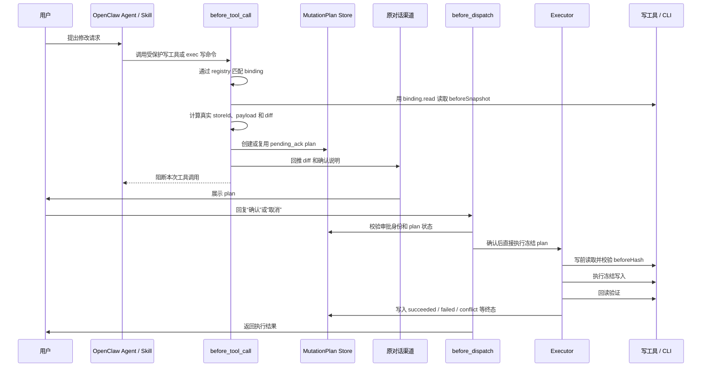

# OpenClaw Safe Mutation 概要技术设计

## 1. 项目核心目的

OpenClaw Safe Mutation 是一个验证型插件，用来证明 OpenClaw 可以在平台侧提供统一的“安全写入兜底”能力。

它要解决的问题不是某一个业务 skill 怎么写得更规范，而是当 OpenClaw 上运行大量第三方或多人贡献的 skill 时，平台不能假设每个 skill 作者都会正确实现高风险写操作的审批、diff、幂等、冲突检测和回读验证。因此项目采用 hook-first 方案：所有匹配 `protectedMutations` binding 的写路径，最终都必须经过统一 hook 拦截，先按显式读配置读取当前状态并冻结真实写请求，再让用户确认，最后由确定性代码执行。

当前仓库用 `mock-full-reduction-config` 作为样例写工具，验证满减活动配置修改场景。这个样例不是最终业务目标，它只是用来证明平台侧统一拦截机制可行。

## 2. 核心设计判断

项目的关键判断是：写操作里最危险的不是模型是否理解了用户意图，而是最终到底提交了什么 payload。

因此系统不让模型在确认后重新生成写参数，也不从自然语言二次推导最终 payload。第一次真实写请求已经包含即将写入的结构化参数，hook 会直接把这份真实 payload 冻结为 `MutationPlan`，用户确认的也是这份即将发生的写入。

这带来几个设计原则：

- 平台侧 hook 是最终硬闸门，skill 作者不需要显式接入一套审批协议。
- 读路径必须来自显式 binding；只注册写工具名不够，平台不能猜对应的读操作。
- `MutationPlan` 是唯一可信冻结对象，审批绑定 plan，不绑定自然语言描述。
- ACK 只表达“这个 plan 被确认/取消”，不能携带新的写入参数。
- 写入前必须检查当前状态是否仍等于冻结时的 `beforeHash`。
- 写入后必须回读验证，不能只相信写接口返回成功。
- 审批身份绑定稳定的人，即 `channel + senderId`，`accountId` 作为可选命名空间增强，不把 `sessionKey` 当作硬前提。

## 3. 总体架构

系统由以下几层组成：

| 层次 | 核心模块 | 责任 |
| --- | --- | --- |
| 插件入口 | `openclaw.entry.ts` | 注册 OpenClaw hooks、加载 `protectedMutations` registry、发送确认消息、消费文本 ACK |
| 变更配置 | `src/mutation-registry.ts` | 显式声明写入口匹配、目标对象抽取、读/写/验证 invocation、normalizer 和字段映射 |
| 写请求识别 | `src/protected-write-request.ts` | 按 registry 把直接工具调用或等价 `exec` 写命令规范化为 `ProtectedWriteRequest` |
| 写入硬闸门 | `src/hooks/before-tool-call.ts` | 判断写请求是否必须阻断，或是否满足已批准 plan 的放行条件 |
| 计划冻结 | `src/protected-write-plan.ts` | 读取/接收写前快照，生成冻结 `MutationPlan`、diff、hash、TTL |
| 计划存储 | `src/plan-store.ts`、`src/file-plan-store.ts` | 持久化 plan，维护活跃计划查询和终态不可回跳规则 |
| 确认命令 | `src/commands/mutate-approve.ts`、`src/commands/mutate-cancel.ts` | 校验审批身份、推进状态、触发执行或取消 |
| 执行器 | `src/executor.ts` | 写前冲突检测、调用写适配器、回读验证、写回最终状态 |
| 适配器 | `src/adapters/*`、`src/tool-backed-adapters.ts` | 隔离读、写、验证实现，当前样例接 mock CLI |
| 展示与输入 | `src/channels/text-render.ts`、`src/text-plan-actions.ts` | 渲染文本确认消息，解析“确认/取消”回复 |

## 4. 主流程

当前文本确认链路里，“回复确认”本身就是执行入口。系统不会等待模型再次调用原写工具，也不会让模型在确认后重新决定 payload。`before_tool_call` 仍然保留 `approvedPlanId` 放行能力，用于支持未来结构化审批后由调用方重试同一写请求的形态。

## 5. 为什么要 hook-first

### 5.1 不依赖 skill 作者质量

只要某个写路径被加入 `protectedMutations` registry，它的写请求就会进入统一审批语义。skill 作者不需要自己实现 `/mutate`、diff、ACK、状态机、幂等和冲突检测。

### 5.2 冻结真实 payload

第一次被拦截的写请求就是 skill 原本准备提交的真实请求。系统直接冻结这份 payload，避免平台在自然语言里重新猜测字段和值。

### 5.3 接入成本低

新增保护对象的理想成本是：

1. 增加一条 mutation binding，声明写入口、目标对象、字段映射和 `read` invocation。
2. 如 direct tool 需要由文本 ACK 直接执行，再显式声明 `write` invocation。
3. 必要时补充 normalizer、`resultPath` 和 catalog 字段。

业务 skill 本身不需要重构成统一命令协议。

## 6. 安全闭环

项目用以下不变量保证写入安全：

- 受保护直接写工具如果没有匹配 binding 或缺少读配置，必须 fail closed。
- unrelated `exec` 不拦截；只有匹配 binding 的写命令才进入审批。
- 没有 `approvedPlanId` 的受保护写请求一律阻断。
- 已批准请求必须满足 plan 存在、状态为 `approved`、未过期、`storeId` 一致、payload 与冻结 `writePayload` 完全一致。
- 同一 `storeId` 默认只能有一个活跃 plan；相同 payload 复用已有 plan，不同 payload 直接提示先处理已有计划。
- `pending_ack`、`approved`、`executing` 是活跃态，`succeeded`、`failed`、`conflict`、`cancelled`、`expired` 是终态。
- 终态 plan 不能回跳到活跃态。
- 执行前重新读取当前配置并比较 `beforeHash`，状态漂移进入 `conflict`，不写入。
- 写入后回读并和冻结 payload 比较，不一致进入 `failed`。
- 重复确认同一个已完成 plan 不会重复写入。

## 7. 确认与回复抑制设计

首次写请求被 hook 阻断后，插件会把确认消息直接发回原始对话，然后阻断工具调用。这个时候模型仍可能在同一轮里尝试补一段普通 assistant 回复，例如“我已为你提交修改”。这种回复会误导用户，因为真实写入还没有发生。

因此项目在 `reply_dispatch` 阶段做 suppression，而不是放在 `before_agent_reply`：

- `before_agent_reply` 发生在 LLM turn 开始前，无法覆盖工具中途被 block 后模型补发的最终回复。
- `reply_dispatch` 位于最终回复分发阶段，可以按 `runId` 吞掉这次普通 assistant 回复。
- 插件用 `directConfirmationRunIds` 记录已直接发送确认卡片/文本的 run，在 `reply_dispatch` 里删除并标记本轮已完成。
- `agent_end` 兜底清理 `runId`，避免集合泄漏。

这个细节是当前闭环成立的关键之一。否则用户会同时看到“待确认 diff”和模型补出来的普通回复，造成写入状态错觉。

## 8. 当前能力边界

当前仓库覆盖的是最小可验证闭环：

- 保护工具：`mock-full-reduction-config`。
- 入口：默认内置 `mock-full-reduction.exec` binding，识别 mock CLI `exec` 写命令；受保护直接写工具若没有 binding 会 fail closed。
- 确认方式：同会话文本确认，但身份不绑定原 session。
- 执行路径：tool-backed adapter 支持冻结的 shell/http invocation；当前真实测试覆盖 mock CLI shell 场景。
- 存储：文件版 plan store。
- 展示：纯文本 diff。

当前不做的事情包括：真实业务写工具接入、飞书/微信 native card、多审批人会签、多字段复杂审批 UI、数据库级事务、依赖模型在确认后重试写入。

## 9. 演进方向

后续从样例走向生产时，应保持核心不变量不变，只替换边缘实现：

- 文本 ACK 可以替换成飞书卡片按钮、审批回调或 Web UI。
- 文件 plan store 可以替换成数据库，但必须保留状态机、终态不可回跳和活跃 plan 查询语义。
- mock CLI binding 可以替换成真实业务 API/CLI binding，但仍要显式声明读前快照、写冻结 payload、回读验证。
- `planId` 可以从文本展示中隐藏，作为卡片 callback 的内部句柄使用，但最终仍要结合审批身份和 plan 状态校验。

核心架构不应改变：平台集中拦截，配置化读写路径，冻结真实 payload，用户确认冻结 plan，纯代码执行，写前冲突检测，写后回读验证。
